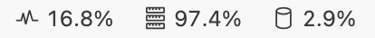
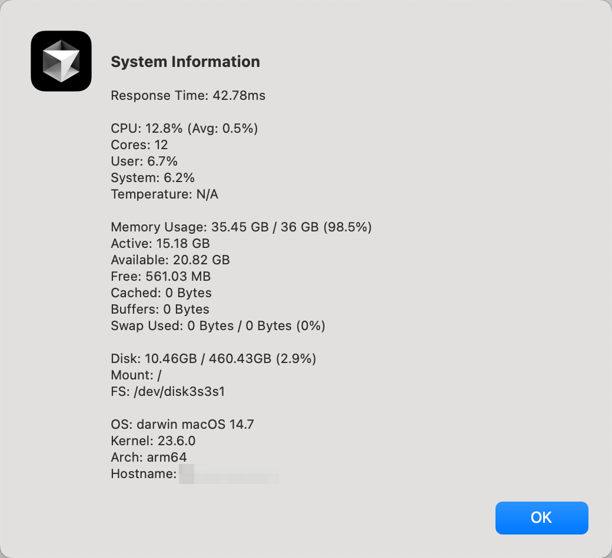

# VS Code System Information Extension

A VS Code extension that displays system information in the status bar, including:

- Response Time
- CPU Usage
- Memory Usage
- Disk Usage

## Features

- Real-time system information displayed in the status bar
- Detailed system information available in a popup window
- Updates every 2 seconds by default

## Screenshots

Status Bar:

Detailed Information:

## Requirements

This extension uses the [systeminformation](https://www.npmjs.com/package/systeminformation) library to gather system metrics.

## Extension Settings

This extension does not contribute any settings yet.

## Known Issues

- On some systems, CPU temperature may not be available
- Response time is measured using internal calls and may not reflect actual system responsiveness

## Release Notes

### 1.0.0

Initial release of the VS Code System Information Extension.

## How to Use

1. Install the extension
2. The system information will automatically appear in the status bar
3. Click on any of the status bar items to see detailed system information

## Development

1. Clone the repository
2. Run `npm install`
3. Press F5 to start debugging

## License

MIT 